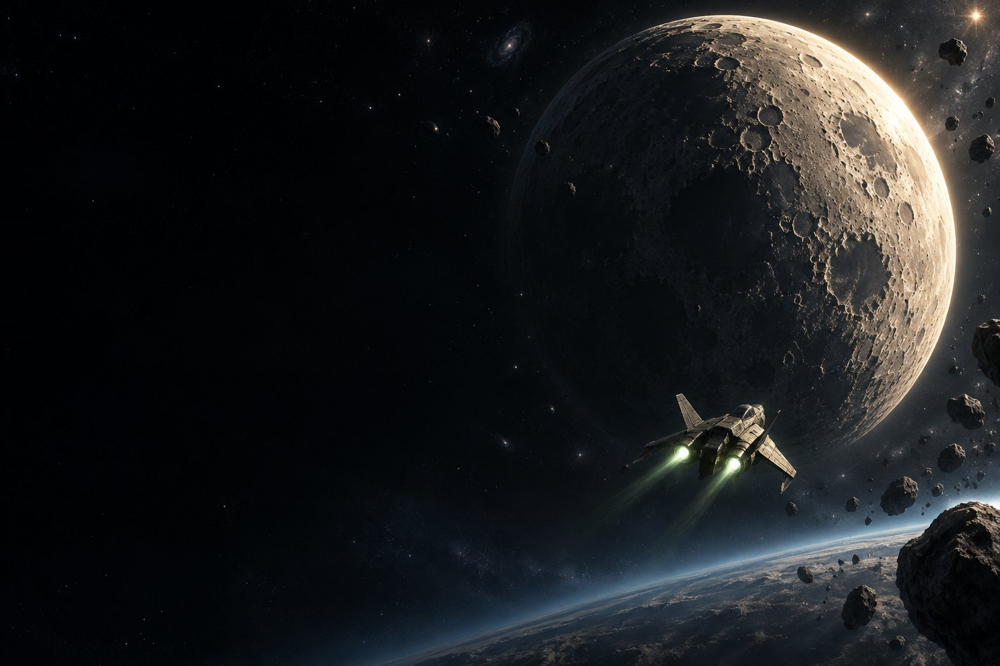

# Space Invaders · Orbital Defense



A cinematic reimagining of the original Space Invaders project. Pilot the Star Defender through four invasion formations and a final mothership encounter, with responsive combat, three difficulty levels, and a scrolling flight manual.

**Vanilla JavaScript · DOM rendering · Zero runtime dependencies · Keyboard + touch**

## Launch locally

Requires **Node.js 22 or newer** and npm.

```sh
git clone https://github.com/hujaafar/Space-Invaders-Game.git
cd Space-Invaders-Game
npm ci
npm run dev
```

Open **http://localhost:4173**, select a difficulty, and choose **Launch mission**. This edition uses ES modules: serve the project over HTTP instead of opening `index.html` directly.

## What changed

- **A complete visual identity.** Original orbital artwork, local fonts, a cinematic hangar, a responsive combat HUD, and a new flight manual.
- **A full campaign.** Five waves, three enemy types, armored brutes, and a mothership finale.
- **More expressive combat.** Continuous fire, rechargeable shields, combo multipliers, particle impacts, and synthesized sound.
- **Reliable gameplay.** Fixed-step simulation, frame-rate-independent movement, swept collisions, safe pause/resume, and clean restarts.
- **Play on keyboard or touch.** Multi-touch controls, visible focus states, modal focus management, and automatic pause when focus is lost.
- **Respectful motion and persistence.** Reduced-motion support; sound off on a first visit; personal bests stored locally and separately by difficulty.
- **A maintainable repository.** Independent simulation, audio, and storage modules; regression tests; repeatable build; and CI on Windows and Linux.

## Controls

| Action | Keyboard | Touch |
| --- | --- | --- |
| Move | ← / → or A / D | Hold the arrow buttons |
| Fire | Hold Space | Hold FIRE |
| Shield | Shift | SHIELD |
| Pause / resume | Escape or P | Pause / Resume buttons |
| Start | Enter from the hangar, or activate Launch mission | Launch mission |

Sound can be enabled with the header toggle. Switching tabs, losing window focus, or scrolling the game entirely out of view pauses an active mission.

## Mission rules

Start with **three lives**. Clear each formation before its timer runs out or it crosses the defense perimeter. Taking a hit grants 1.6 seconds of temporary protection.

| Difficulty | Time per formation | Enemy speed | Base score factor | Mothership HP |
| --- | --- | --- | --- | --- |
| Rookie | 90 seconds | 0.75× | 0.75× | 26 |
| Pilot | 75 seconds | 1× | 1× | 36 |
| Ace | 65 seconds | 1.3× | 1.5× | 46 |

The final mothership encounter has **100 seconds** on every difficulty. Enemy firing cadence and projectile speed also increase with difficulty.

- Scouts award **100**, drones **150**, and brutes **250** base points. Brutes take two hits from wave three onward.
- Each four consecutive hits increases the multiplier by one, up to **4×**. A gap of three seconds or hull damage resets the chain.
- A shield lasts **two seconds** and recharges **ten seconds after activation**.
- Clearing a formation adds **10 points for each remaining second**, rounded up. The mothership awards **5,000 base points**.
- Accuracy counts successful projectile hits, including armor hits, divided by shots fired.
- Personal bests belong to this browser and difficulty. There is no shared online leaderboard.

## Development commands

| Command | Purpose |
| --- | --- |
| `npm run dev` | Start the local server on port 4173 |
| `npm run check` | Check JavaScript syntax |
| `npm test` | Run the automated regression and asset checks |
| `npm run build` | Create the production site in `dist/` |
| `npm run preview` | Serve the built site locally |

Set the `PORT` environment variable to use a different preview port. No API keys or environment secrets are required. The build includes only current runtime assets; original unused media remain in the checkout.

## Project map

```text
index.html                Hangar, game surface, overlays, flight manual
style.css                 Shared theme, responsive layout, scroll effects
appHandler.js             Browser input, rendering, lifecycle, focus
src/
  engine.js               Pure, testable gameplay simulation
  audio.js                Web Audio effects
  storage.js              Safe local settings and high scores
images/                   Current and original artwork / sprites
fonts/                    Local WOFF2 fonts and their licenses
sounds/                   Original audio, retained for reference
scripts/                  Preview server and production build
tests/                    Gameplay, storage, and asset regression tests
docs/                     Architecture, asset credits, manual QA guide
.github/                  CI, bug report form, pull request template
```

For deeper details, read [Architecture](docs/ARCHITECTURE.md), [Contributing](CONTRIBUTING.md), [Quality assurance](docs/QA.md), [Asset credits](docs/ASSETS.md), and [Changelog](CHANGELOG.md).

## Deployment

Run `npm run build` and serve the contents of `dist/` with a static host. All runtime asset paths are relative, so the build can also be hosted under a repository subpath. The included Sites configuration declares the same static output. CI validates changes; it does not automatically publish a public site.

## Credits

Original project by **Abdulla Yusuf (`abdyusuf`)**, **Habib Mansoor (`hmansoor`)**, and **HUSAIN JAAFAR (`hujaafar`)**. This edition preserves the original DOM-based approach and player/invader sprites.

Space Grotesk and IBM Plex Mono are distributed under the SIL Open Font License; their licenses are included in `fonts/`. Full artwork and source attribution is in [Asset credits](docs/ASSETS.md).
